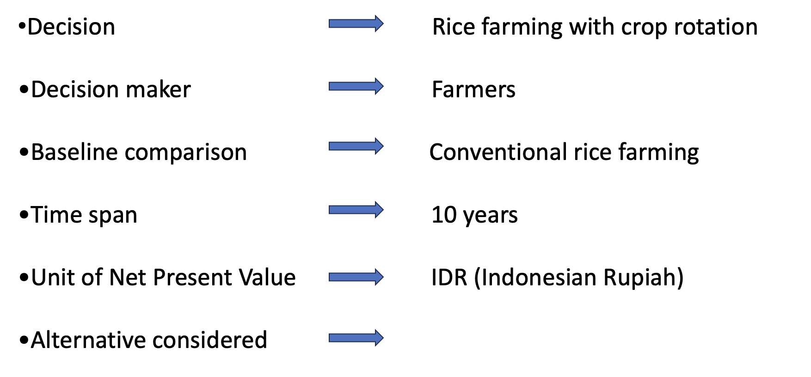
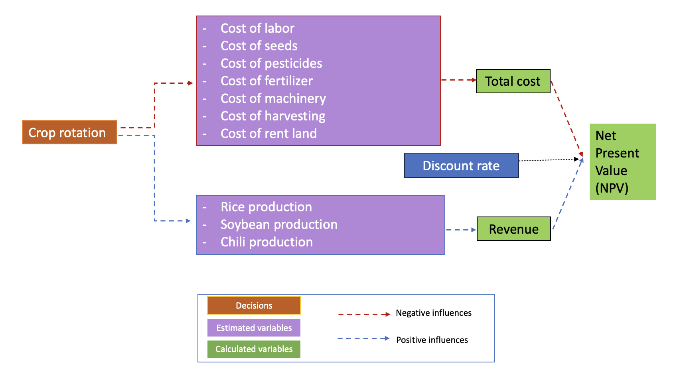
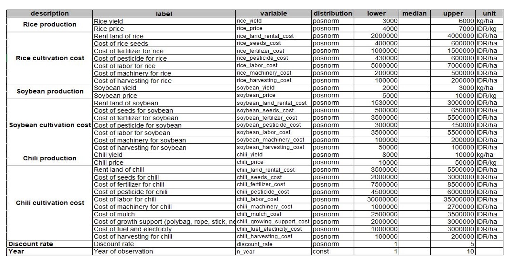
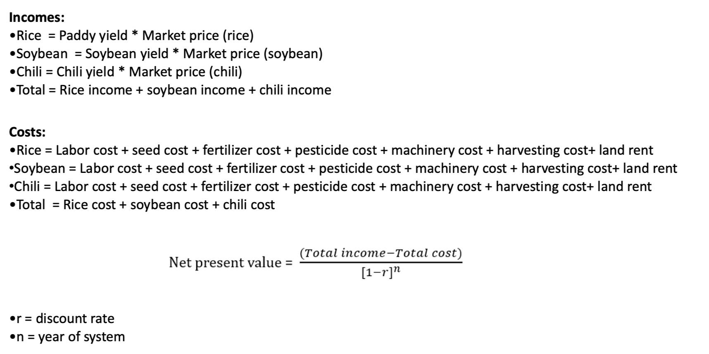

```{r setup, include=FALSE}
knitr::opts_chunk$set(echo = TRUE)
```
## Introduction
### Overview

  Indonesia is the largest country in Southeast Asia.Rice is the primary staple food crop with a steady increase in annual production, making Indonesia the third largest rice producer in the world. 93% of Indonesia’s total number of farmers are small family farms. Rice is the main crop grown and staple food in Southeast Asia. 
  Crop rotation is the practice of planting different crops sequentially on the same plot of land to improve soil health, optimize nutrients in the soil, and combat pest and weed pressure.
    - Soybean (Glycine max) is a species of legume native to East Asia, widely grown for its edible bean which has numerous uses.
    - Chili (Capsicum annum L.)  is a plant of tropical and subtropical regions  for their fleshy fruits

### Motivation

1. Rice is the primary staple food crop with a steady increase in annual production, making Indonesia the third largest rice producer in the world. 
2. Crop rotation can increase crop yields and income than monoculture of rice and it can help disrupt the lifecycle of crop pests and reducing chemical use.
3. Soybean can increase soil fertility and give extra income to farmers.
4. Chili cultivation can improve farmers' income  because of good market price.


### Overview of the project

<center>
```{r echo=FALSE}

```
</center>


### Conception model 

Rice farm with crop rotation. Crop rotation for this project is chilli ana soybean. Total cost per crop are consists of labor, seeds, pesticides, fertilizer, machinery and rent land. Moreover, Revenues is yield of rice, soybean and chilli. Finally, total cost, revenues and discount rate use put to calculate to Net Present Value(NVP).

```{r echo=FALSE}

```


## R code
### Variable used in conceptual and mathemetical formulation

```{r}
read.csv("new_variable_estimates.csv",sep=";")
```

<center>
```{r echo=FALSE}

```


</center>

# Decision analysis


## Estimate calculation

=======
### Variable used in conceptual model

```{r eval=FALSE, include=FALSE}
read.csv("new_variable_estimates.csv",sep=";")
```

<center>
```{r echo=FALSE}

```
</center>
Variable for rice farm and crop rotation for small holder farmers in Indonesia have 8 mains variable and this consists of production, rice cultivation cost, soybean production, soybean cultivation cost, chilli production, chilli cultivation cost, discount rate and year of system. This project use 37 variable estimate to calculate


## Estimate Calculation
```{r echo=FALSE}

```


## R code
### Decision analysis


```{r include=FALSE}
library(tidyverse)
library(decisionSupport)
library(ggplot2)
```

```{r echo=TRUE}

  crop_rotation_decision <- function(){
  
  # Estimate the income of rice in a normal season
  rice_income <- rice_yield * rice_price
  
  # Estimate the income of soybean in a normal season
  soybean_income <- soybean_yield * soybean_price
  
  # Estimate the income of chili in a normal season
  chili_income <- chili_yield * chili_price
  
  #Estimate the cost of rice farm in a normal season
  rice_cost <- sum(rice_land_rental_cost, rice_seeds_cost, rice_fertilizer_cost,
                   rice_pesticide_cost, rice_machinery_cost, rice_harvesting_cost)
  
  #Estimate the cost of soybean farm in a normal season
  soybean_cost <- sum(soybean_land_rental_cost, soybean_seeds_cost, soybean_fertilizer_cost,
                      soybean_pesticide_cost, soybean_machinery_cost, soybean_harvesting_cost)
  
  #Estimate the cost in a normal season
  chili_cost <- sum(chili_land_rental_cost, chili_seeds_cost, chili_fertilizer_cost,
                    chili_pesticide_cost, chili_machinery_cost, chili_harvesting_cost)
  
  # Estimate the profit
  rice_profit <- vv(rice_income - rice_cost,n=n_year,var_CV=100)
  soybean_profit <- vv(soybean_income - soybean_cost,n=n_year,var_CV=100)
  chili_profit <- vv(chili_income - chili_cost,n=n_year,var_CV=100)
  
  # Final result
  crop_rotation_result = rice_profit + soybean_profit + chili_profit
  rice_cultivation_result = rice_profit*3
  
  # NPV
  NPV_crop_rotation <- discount(crop_rotation_result, discount_rate, calculate_NPV = TRUE)
  NPV_rice <- discount(rice_cultivation_result, discount_rate, calculate_NPV = TRUE)
  NPV_crop_rotation_income <- discount(rice_income + soybean_income + chili_income, discount_rate, calculate_NPV = TRUE)
  NPV_rice_income <- discount(rice_income, discount_rate, calculate_NPV = TRUE)
  NPV_crop_rotation_cost <- discount(rice_cost + soybean_cost + chili_cost, discount_rate, calculate_NPV = TRUE)
  NPV_rice_cost <- discount(rice_cost, discount_rate, calculate_NPV = TRUE)
  
  # Generate the list of outputs from the Monte Carlo simulation
  return(list(NPV_crop_rotation=NPV_crop_rotation, NPV_rice=NPV_rice,
              NPV_crop_rotation_income=NPV_crop_rotation_income, NPV_rice_income=NPV_rice_income,
              NPV_crop_rotation_cost=NPV_crop_rotation_cost, NPV_rice_cost=NPV_rice_cost,
              crop_rotation_result=crop_rotation_result,
              rice_cultivation_result=rice_cultivation_result))
}
```


```{r echo=FALSE}

```


Note that the `echo = FALSE` parameter was added to the code chunk to prevent printing of the R code that generated the plot.


### Cashflow
```{r}

```


## Projection to laten structurees(PLS)
```{r}

```


## Value of information(Vol) anylasis
```{r}

```


# Result

# Outcome

# Recommendation

# Conclusion
=======
crop_rotation_decision <- function(){
  
  # Estimate the income of rice in a normal season
  rice_income <- vv(rice_yield * rice_price, n=n_year, var_CV=100)
  
  # Estimate the income of soybean in a normal season
  soybean_income <- vv(soybean_yield * soybean_price, n=n_year, var_CV=100)
  
  # Estimate the income of chili in a normal season
  chili_income <- vv(chili_yield * chili_price, n=n_year, var_CV=100)
  
  #Estimate the cost of rice farm in a normal season
  rice_cost_precal <- sum(rice_land_rental_cost, rice_seeds_cost, rice_fertilizer_cost,
                          rice_pesticide_cost, rice_machinery_cost, rice_harvesting_cost)
  rice_cost <- vv(rice_cost_precal, n=n_year, var_CV=100)
  
  
  #Estimate the cost of soybean farm in a normal season
  soybean_cost_precal <- sum(soybean_land_rental_cost, soybean_seeds_cost, soybean_fertilizer_cost,
                             soybean_pesticide_cost, soybean_machinery_cost, soybean_harvesting_cost)
  soybean_cost <- vv(soybean_cost_precal, n=n_year, var_CV=100)
  
  
  #Estimate the cost in a normal season
  chili_cost_precal <- sum(chili_land_rental_cost, chili_seeds_cost, chili_fertilizer_cost,
                           chili_pesticide_cost, chili_machinery_cost, chili_harvesting_cost)
  chili_cost <- vv(chili_cost_precal, n=n_year, var_CV=100)
  
  
  # Estimate the profit
  rice_profit <- vv(rice_income - rice_cost, n=n_year, var_CV=100)
  soybean_profit <- vv(soybean_income - soybean_cost, n=n_year, var_CV=100)
  chili_profit <- vv(chili_income - chili_cost, n=n_year, var_CV=100)
  
  
  # Final result
  #assuming rice cultivation is 3 times per year  
  rice_cultivation_result = vv(rice_profit*3, n=n_year, var_CV=100)
  
  #crop rotation decision scenario
  #if crop rotation of 3 crops is done in one year
  crop_rotation_result = vv(rice_profit + soybean_profit + chili_profit, n=n_year, var_CV=100)
  
  #if crop rotation of rice and soybean is done in one year (rice-soybean-rice)
  rice_soybean_result = vv((rice_profit*2) + soybean_profit, n=n_year, var_CV=100)
  
  #if crop rotation of rice and chili is done in one year (rice-chili)
  rice_chili_result = vv(rice_profit + chili_profit, n=n_year, var_CV=100)
  
  
  # NPV
  NPV_rice <- discount(rice_cultivation_result, discount_rate, calculate_NPV = TRUE)
  NPV_crop_rotation <- discount(crop_rotation_result, discount_rate, calculate_NPV = TRUE)
  NPV_rice_soybean <- discount(rice_soybean_result, discount_rate, calculate_NPV = TRUE)
  NPV_rice_chili <- discount(rice_chili_result, discount_rate, calculate_NPV = TRUE)
  
  
  # Cashflow
  cashflow_crop_rotation <- crop_rotation_result - rice_cultivation_result
  cashflow_rice_soybean <- rice_soybean_result - rice_cultivation_result
  cashflow_rice_chili <- rice_chili_result - rice_cultivation_result
  
  
  # Generate the list of outputs from the Monte Carlo simulation
  return(list(Rice_NPV = NPV_rice,
              crop_rotation_NPV = NPV_crop_rotation,
              rice_soybean_NPV = NPV_rice_soybean,
              rice_chili_NPV= NPV_rice_chili,
              NPV_decision_crop_rotation = NPV_crop_rotation - NPV_rice,
              NPV_decision_rice_soybean = NPV_rice_soybean - NPV_rice,
              NPV_decision_rice_chili = NPV_rice_chili - NPV_rice,
              cashflow_crop_rotation = cashflow_crop_rotation,
              cashflow_rice_soybean = cashflow_rice_soybean,
              cashflow_rice_chili = cashflow_rice_chili
  ))
}


make_variables<-function(est,n=1)
{ x<-random(rho=est, n=n)
for(i in colnames(x)) assign(i, as.numeric(x[1,i]),envir=.GlobalEnv)}

make_variables(read.csv("new_variable_estimates.csv"))

# Run the Monte Carlo simulation using the model function
input_estimates <- read.csv("new_variable_estimates.csv", sep=";")

crop_rotation_mc_simulation <- mcSimulation(estimate = as.estimate(input_estimates),
                                            model_function = crop_rotation_decision,
                                            numberOfModelRuns = 1000,
                                            functionSyntax = "plainNames")

# Run the Monte Carlo simulation using the model function
input_estimates <- read.csv("new_variable_estimates.csv", sep=";")

crop_rotation_mc_simulation <- mcSimulation(estimate = as.estimate(input_estimates),
                                            model_function = crop_rotation_decision,
                                            numberOfModelRuns = 1000,
                                            functionSyntax = "plainNames")

```


### Plot NPV distribution analysis

#### NPV for crop-rotation

#if rice with soybean and chili (rice-soybean-chili)
decisionSupport::plot_distributions(mcSimulation_object = crop_rotation_mc_simulation, 
                                    vars = c("NPV_decision_crop_rotation", "Rice_NPV"),
                                    method = 'smooth_simple_overlay')
decisionSupport::plot_distributions(mcSimulation_object = crop_rotation_mc_simulation, 
                                    vars = "NPV_decision_crop_rotation",
                                    method = 'boxplot')
```


#### NPV for rice-soybean-rice
#if rice with soybean (rice-soybean-rice)
decisionSupport::plot_distributions(mcSimulation_object = crop_rotation_mc_simulation, 
                                    vars = c("NPV_decision_rice_soybean","Rice_NPV"),
                                    method = 'smooth_simple_overlay')
decisionSupport::plot_distributions(mcSimulation_object = crop_rotation_mc_simulation, 
                                    vars = "NPV_decision_rice_chili",
                                    method = 'boxplot')
```


#### NPV for rice-chilli
#if rice with chili (rice-chili)
decisionSupport::plot_distributions(mcSimulation_object = crop_rotation_mc_simulation, 
                                    vars = c("NPV_decision_rice_chili","Rice_NPV"),
                                    method = 'smooth_simple_overlay')
decisionSupport::plot_distributions(mcSimulation_object = crop_rotation_mc_simulation, 
                                    vars = "NPV_decision_rice_chili",
                                    method = 'boxplot')
```

### Cashflow analysis

#### With crop rotation of 3 crops
<center>
```{r}
plot_cashflow(mcSimulation_object = crop_rotation_mc_simulation, cashflow_var_name = "cashflow_crop_rotation")
```
</center>

#### with crop rotation of rice and soybean (rice-soybean-rice)
<center>
```{r}
plot_cashflow(mcSimulation_object = crop_rotation_mc_simulation, cashflow_var_name = "cashflow_rice_soybean")
```
</center>

#### with crop rotation of rice and chili (rice-chili)
<center>
```{r}

plot_cashflow(mcSimulation_object = crop_rotation_mc_simulation, cashflow_var_name = "cashflow_rice_chili")
```
</center>


### Value of Information (VoI) analysis

<center>
```{r}
mcSimulation_table <- data.frame(crop_rotation_mc_simulation$x, crop_rotation_mc_simulation$y[1:7])
```
</center>

#### EVPI crop rotation
<center>
```{r}
evpi_crop_rotation <- multi_EVPI(mc = mcSimulation_table, first_out_var = "crop_rotation_NPV")
plot_evpi(evpi_crop_rotation, decision_vars = "NPV_decision_crop_rotation")
```
</center>

#### EVPI rice and soybean
<center>
```{r}
evpi_rice_soybean <- multi_EVPI(mc = mcSimulation_table, first_out_var = "rice_soybean_NPV")
plot_evpi(evpi_rice_soybean, decision_vars = "NPV_decision_rice_soybean")
```
</center>

#### EVPI rice and chilli
<center>
```{r}
evpi_rice_chili <- multi_EVPI(mc = mcSimulation_table, first_out_var = "rice_chili_NPV")
plot_evpi(evpi_rice_chili, decision_vars = "NPV_decision_rice_chili")
```
</center>

### Projection to Latent Structures (PLS) analysis

#### With crop rotation of rice, soybean, and chili
<center>
```{r}
pls_result_crop_rotation <- plsr.mcSimulation(object = crop_rotation_mc_simulation,
                                              resultName = names(crop_rotation_mc_simulation$y)[5], ncomp = 1)
plot_pls(pls_result_crop_rotation, threshold = 0)
```
</center>

#### With crop rotation of rice and soybean (rice-soybean-rice)
<center>
```{r}
pls_result_rice_soybean <- plsr.mcSimulation(object = crop_rotation_mc_simulation,
                                             resultName = names(crop_rotation_mc_simulation$y)[6], ncomp = 1)
plot_pls(pls_result_rice_soybean, threshold = 0)
```
</center>

#### With crop rotation of rice and chili (rice-chili)
<center>
```{r}
pls_result_rice_chili <- plsr.mcSimulation(object = crop_rotation_mc_simulation,
                                           resultName = names(crop_rotation_mc_simulation$y)[7], ncomp = 1)
plot_pls(pls_result_rice_chili, threshold = 0)
```
</center>

## Results

### With crop rotation of 3 crops
<center>
```{r}
compound_figure(mcSimulation_object = crop_rotation_mc_simulation, 
                input_table = input_estimates, plsrResults = pls_result_crop_rotation, 
                EVPIresults = evpi_crop_rotation, decision_var_name = "NPV_decision_crop_rotation", 
                cashflow_var_name = "cashflow_crop_rotation", 
                base_size = 7)
```
</center>


### With crop rotation of rice and soybean (rice-soybean-rice)
<center>
```{r}
compound_figure(mcSimulation_object = crop_rotation_mc_simulation, 
                input_table = input_estimates, plsrResults = pls_result_rice_soybean, 
                EVPIresults = evpi_rice_soybean, decision_var_name = "NPV_decision_rice_soybean", 
                cashflow_var_name = "cashflow_rice_soybean", 
                base_size = 7)
```
</center>

### With crop rotation of rice and chili (rice-chili) 
<center>
```{r}
compound_figure(mcSimulation_object = crop_rotation_mc_simulation, 
                input_table = input_estimates, plsrResults = pls_result_rice_chili, 
                EVPIresults = evpi_rice_chili, decision_var_name = "NPV_decision_rice_chili", 
                cashflow_var_name = "cashflow_rice_chili", 
                base_size = 7)
```
</center>

## Conclusion

1. Our project has proven that selecting the appropriate crop rotation between rice, soybean, and chili to produce the best profits is crucial for achieving optimal results.
2. The decision to rotate crops between rice and chili is still applicable with slightly smaller profits.
3. Crop rotation between rice, soybeans, and rice is less efficient than other options with respect to profit and sustainability.


## Recommendtion

It is highly recommended for Indonesian smallholder farmers to implement three crop rotations (rice, soybean, and chili) as it is more suitable for sustainable development.

## What have we learned from this project?

 Crop rotation is crucial for maintaining the soil's physical, chemical, and biological properties, as well as for improving crop yields and farmers' income. 
 
## Reference

```{r add_R_bib, include=FALSE}
knitr::write_bib(c(.packages(),
                   'knitr','decisionSupport'), 'export.bib')
```


