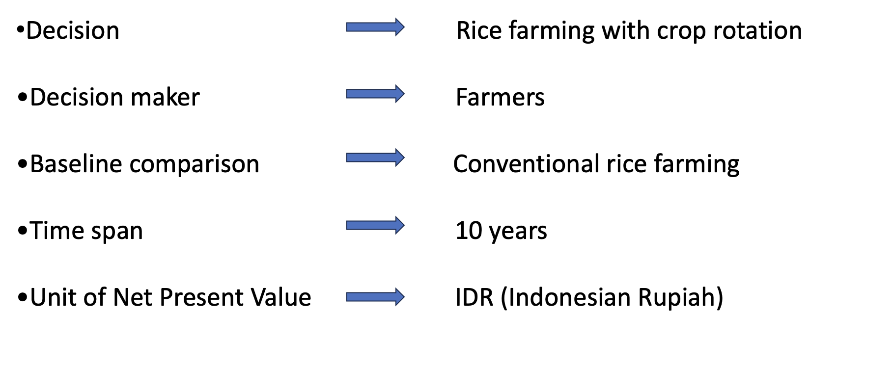

```{r setup, include=FALSE}
knitr::opts_chunk$set(echo = TRUE)
```

# Introduction

Rice is the primary staple food crop with a steady increase in annual production, making Indonesia the third largest rice producer in the world. 93% of Indonesia’s total number of farmers are small family farms.

# Motivation

Crop rotation can increase crop yields and income than monoculture of rice and it can help disrupt the lifecycle of crop pests and reducing chemical use. Soybean can increase soil fertility and give extra income to farmers. Chili cultivation can improve farmers' income.


# Overview of the project

<center>
```{r echo=FALSE}

```
</center>


# Conception model 

Rice farm with crop rotation. Crop rotation for this project is chilli ana soybean. Total cost per crop are consists of labor, seeds, pesticides, fertilizer, machinery and rent land. Moreover, Revenues is yield of rice, soybean and chilli. Finally, total cost, revenues and discount rate use put to calculate to Net Present Value(NVP).


```{r echo=FALSE}
knitr::include_graphics('Photo rice farm with crop rotation/conceptual model.png')
```


## R code
### Variable used in conceptual and mathemetical formulation

```{r}
read.csv("new_variable_estimates.csv",sep=";")
```

<center>
```{r echo=FALSE}
knitr::include_graphics('Photo rice farm with crop rotation/Variable estimate.png')
```


</center>

# Decision analysis


## Estimate calculation


```{r include=FALSE}
library(tidyverse)
library(decisionSupport)
library(ggplot2)
```

```{r echo=TRUE}

  crop_rotation_decision <- function(){
  
  # Estimate the income of rice in a normal season
  rice_income <- rice_yield * rice_price
  
  # Estimate the income of soybean in a normal season
  soybean_income <- soybean_yield * soybean_price
  
  # Estimate the income of chili in a normal season
  chili_income <- chili_yield * chili_price
  
  #Estimate the cost of rice farm in a normal season
  rice_cost <- sum(rice_land_rental_cost, rice_seeds_cost, rice_fertilizer_cost,
                   rice_pesticide_cost, rice_machinery_cost, rice_harvesting_cost)
  
  #Estimate the cost of soybean farm in a normal season
  soybean_cost <- sum(soybean_land_rental_cost, soybean_seeds_cost, soybean_fertilizer_cost,
                      soybean_pesticide_cost, soybean_machinery_cost, soybean_harvesting_cost)
  
  #Estimate the cost in a normal season
  chili_cost <- sum(chili_land_rental_cost, chili_seeds_cost, chili_fertilizer_cost,
                    chili_pesticide_cost, chili_machinery_cost, chili_harvesting_cost)
  
  # Estimate the profit
  rice_profit <- vv(rice_income - rice_cost,n=n_year,var_CV=100)
  soybean_profit <- vv(soybean_income - soybean_cost,n=n_year,var_CV=100)
  chili_profit <- vv(chili_income - chili_cost,n=n_year,var_CV=100)
  
  # Final result
  crop_rotation_result = rice_profit + soybean_profit + chili_profit
  rice_cultivation_result = rice_profit*3
  
  # NPV
  NPV_crop_rotation <- discount(crop_rotation_result, discount_rate, calculate_NPV = TRUE)
  NPV_rice <- discount(rice_cultivation_result, discount_rate, calculate_NPV = TRUE)
  NPV_crop_rotation_income <- discount(rice_income + soybean_income + chili_income, discount_rate, calculate_NPV = TRUE)
  NPV_rice_income <- discount(rice_income, discount_rate, calculate_NPV = TRUE)
  NPV_crop_rotation_cost <- discount(rice_cost + soybean_cost + chili_cost, discount_rate, calculate_NPV = TRUE)
  NPV_rice_cost <- discount(rice_cost, discount_rate, calculate_NPV = TRUE)
  
  # Generate the list of outputs from the Monte Carlo simulation
  return(list(NPV_crop_rotation=NPV_crop_rotation, NPV_rice=NPV_rice,
              NPV_crop_rotation_income=NPV_crop_rotation_income, NPV_rice_income=NPV_rice_income,
              NPV_crop_rotation_cost=NPV_crop_rotation_cost, NPV_rice_cost=NPV_rice_cost,
              crop_rotation_result=crop_rotation_result,
              rice_cultivation_result=rice_cultivation_result))
}
```


```{r echo=FALSE}
knitr::include_graphics('Photo rice farm with crop rotation/Estimate calculation.png')
```


Note that the `echo = FALSE` parameter was added to the code chunk to prevent printing of the R code that generated the plot.


### Cashflow
```{r}

```


## Projection to laten structurees(PLS)
```{r}

```


## Value of information(Vol) anylasis
```{r}

```


# Result

# Outcome

# Recommendation

# Conclusion


