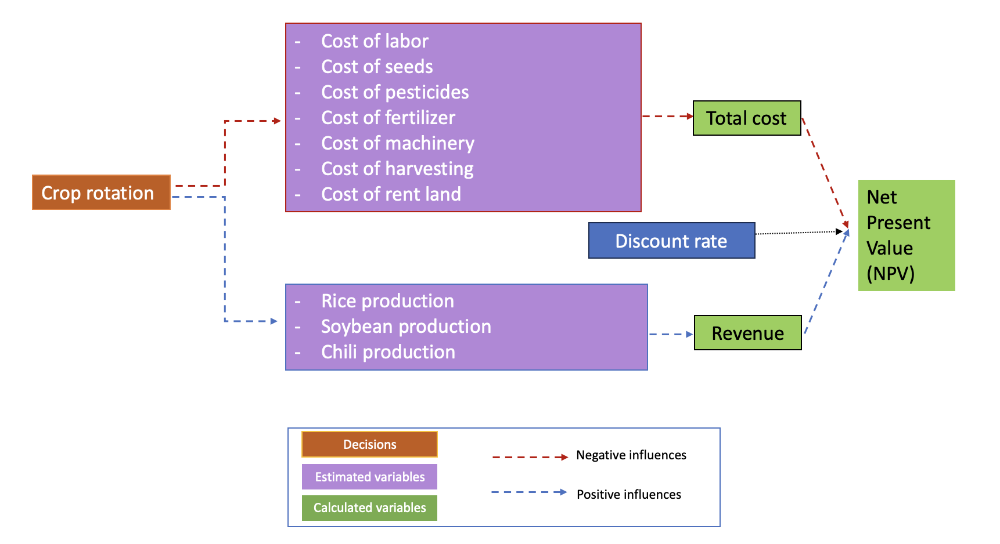
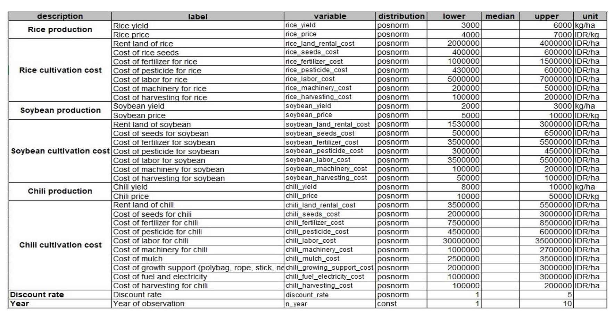
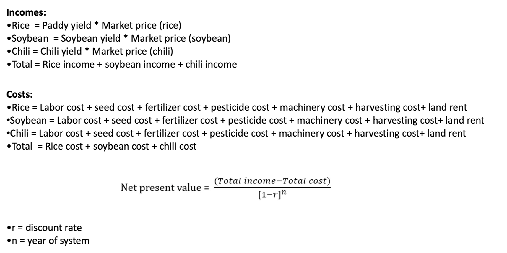

```{r setup, include=FALSE}
knitr::opts_chunk$set(echo = TRUE)
```

## Introduction
### Overview

  Rice is known as one of the main crops and a staple food in Southeast Asia (@Yoshida1981). Indonesia is one of the largest countries in Southeast Asia, and rice is one of their main staple crops. With an increase in production every year, Indonesia has become the third-largest rice producer in the world, with around 93% of Indonesian farmers possessing small family farms (@Fao2018).
  
  Crop rotation is a method of cultivating different crops sequentially on the same field that has the benefit of increasing soil fertility, enhancing nutrients in the soil, and reducing pest and weed pressure (@Crystal2004). Crop rotation can be implemented by growing several valuable crops, such as rice, soybeans, and chili, and these three crops are commonly grown in Indonesia.
  
  Soybean is one of the legume species that originated in East Asia, and it is widely cultivated to be consumed as beans and for numerous other uses (@Wright2005). In Indonesia, soybean is known as the third-most important food crop after rice and maize, and the consumption of soybean tends to rise year after year (@Harsono2021).
Chili is a tropical and subtropical regional crop for fleshy fruits (@MOALF2016), and it is also one of the commodities that is known to have an economic value that is relatively high in Indonesia (@Sundari2021).

  Implementing rice farming with crop rotation could potentially be advantageous for smallholder farmers in Indonesia, as it holds the promise of increased profitability through diversified income from different crops. Therefore, this project is undertaken to determine the profitability of implementing the decision of rice farming with crop rotation for smallholders in Indonesia.
  
### Motivation

Our motivation to conduct the decision analysis of Rice farming with crop rotation in Indonesia is outlined as follows:

1.	Rice stands as the primary staple food in Indonesia and a majority of smallholder farmers cultivate it.
2.	The implementation of crop rotation offers several advantages, including: increasing crop yield, improving soil fertility, and reducing infestation of pests and diseases in the field. Thus, it is likely to bring benefits to smallholder farmers. In addition, the farmers can generate income from a diverse range of crops they cultivated within a year, which could potentially result in greater profitability for smallholder farmers.
3.	Soybean is one of the valuable crops that is commonly grown by Indonesian farmers. Beyond its economic value, soybean as a legume functioning as a nitrogen-fixing crop, has the potential to enhance field sustainability.
4.	Chilli as one of the most highly prized horticultural crops commonly cultivated in Indonesia, potentially gives an opportunity for the smallholder farmers to gain more significant income.


### Overview of the project

<center>
```{r echo=FALSE}
knitr::include_graphics('Photo rice farm with crop rotation/overview of the project.png')
```
</center>


### Conceptual model 

This project analyzes the decision of crop rotation (soybean and chili) with rice farming.
The total cost is calculated for each crop, which consists of labor, seeds, pesticides, fertilizer, machinery, and renting land.
The revenues are calculated for each crop production by multiplying the yield of each crop by the selling price of each crop per ha. 
The total cost, revenues, and discount rate are used as variable estimates in order to calculate the Net Present Value (NVP).

```{r echo=FALSE}

```


### Variable used in conceptual model

```{r eval=FALSE, include=FALSE}
read.csv("new_variable_estimates.csv",sep=";")
```

<center>
```{r echo=FALSE}

```
</center>
There are eight main variables that are used to analyze the decision of rice farming and crop rotation for smallholder farmers in Indonesia: rice production, rice cultivation cost, soybean production, soybean cultivation cost, chili production, chili cultivation cost, discount rate, and year of system. Overall, there are 33 variables that are used for this decision analysis.

**Source** :

@BPS2018, @Mucharam2020, @Jagung2017, @Fao2018, @BPS2022, @Amirrullah2019, @Crystal2004, @Jagung2017, @BRIN2022, @USDA2012, @Setiartiti2021, @Antriyandarti2015, @Krisdiana2021, @Harsono2020, @Schilling1999, @Wandschneider2019, @Sundari2021

## Estimate Calculation
```{r echo=FALSE}

```

In this analysis, the Net Present Value (NPV) is calculated by dividing the difference total income and total outcome from the cultivation in the year of system by the value of 1 minus the ‘discount rate’ (r) to the power of ‘number of years in the system’ (n).

**NPV (Net Present Value)**: In financial terms, NPV is the measurement of the profitability of a project or program. This is achieved by subtracting the current values of expenditure from the current values of income over a period of time. Income can be referred to as a benefit, and expenditure can be referred to as a cost.

**Discount Rate**: The discount rate is the interest rate used in analysis of discounted cash flow (DCF) (@Stantec2005).


## Decision analysis
### R code

Cory Whitney, Eike Luedeling et al.

```{r include=FALSE}
library(tidyverse)
library(decisionSupport)
library(ggplot2)
```

```{r echo=TRUE}
crop_rotation_decision <- function(){
  
  # Estimate the income of rice in a normal season
  rice_income <- vv(rice_yield * rice_price, n=n_year, var_CV=100)
  
  # Estimate the income of soybean in a normal season
  soybean_income <- vv(soybean_yield * soybean_price, n=n_year, var_CV=100)
  
  # Estimate the income of chili in a normal season
  chili_income <- vv(chili_yield * chili_price, n=n_year, var_CV=100)
  
  #Estimate the cost of rice farm in a normal season
  rice_cost_precal <- sum(rice_land_rental_cost, rice_seeds_cost, rice_fertilizer_cost,
                          rice_pesticide_cost, rice_machinery_cost, rice_harvesting_cost)
  rice_cost <- vv(rice_cost_precal, n=n_year, var_CV=100)
  
  
  #Estimate the cost of soybean farm in a normal season
  soybean_cost_precal <- sum(soybean_land_rental_cost, soybean_seeds_cost, soybean_fertilizer_cost,
                             soybean_pesticide_cost, soybean_machinery_cost, soybean_harvesting_cost)
  soybean_cost <- vv(soybean_cost_precal, n=n_year, var_CV=100)
  
  
  #Estimate the cost in a normal season
  chili_cost_precal <- sum(chili_land_rental_cost, chili_seeds_cost, chili_fertilizer_cost,
                           chili_pesticide_cost, chili_machinery_cost, chili_harvesting_cost)
  chili_cost <- vv(chili_cost_precal, n=n_year, var_CV=100)
  
  
  # Estimate the profit
  rice_profit <- vv(rice_income - rice_cost, n=n_year, var_CV=100)
  soybean_profit <- vv(soybean_income - soybean_cost, n=n_year, var_CV=100)
  chili_profit <- vv(chili_income - chili_cost, n=n_year, var_CV=100)
  
  
  # Final result
  #assuming rice cultivation is 3 times per year  
  rice_cultivation_result = vv(rice_profit*3, n=n_year, var_CV=100)
  
  #crop rotation decision scenario
  #if crop rotation of 3 crops is done in one year
  crop_rotation_result = vv(rice_profit + soybean_profit + chili_profit, n=n_year, var_CV=100)
  
  #if crop rotation of rice and soybean is done in one year (rice-soybean-rice)
  rice_soybean_result = vv((rice_profit*2) + soybean_profit, n=n_year, var_CV=100)
  
  #if crop rotation of rice and chili is done in one year (rice-chili)
  rice_chili_result = vv(rice_profit + chili_profit, n=n_year, var_CV=100)
  
  
  # NPV
  NPV_rice <- discount(rice_cultivation_result, discount_rate, calculate_NPV = TRUE)
  NPV_crop_rotation <- discount(crop_rotation_result, discount_rate, calculate_NPV = TRUE)
  NPV_rice_soybean <- discount(rice_soybean_result, discount_rate, calculate_NPV = TRUE)
  NPV_rice_chili <- discount(rice_chili_result, discount_rate, calculate_NPV = TRUE)
  
  
  # Cashflow
  cashflow_crop_rotation <- crop_rotation_result - rice_cultivation_result
  cashflow_rice_soybean <- rice_soybean_result - rice_cultivation_result
  cashflow_rice_chili <- rice_chili_result - rice_cultivation_result
  
  
  # Generate the list of outputs from the Monte Carlo simulation
  return(list(Rice_NPV = NPV_rice,
              crop_rotation_NPV = NPV_crop_rotation,
              rice_soybean_NPV = NPV_rice_soybean,
              rice_chili_NPV= NPV_rice_chili,
              NPV_decision_crop_rotation = NPV_crop_rotation - NPV_rice,
              NPV_decision_rice_soybean = NPV_rice_soybean - NPV_rice,
              NPV_decision_rice_chili = NPV_rice_chili - NPV_rice,
              cashflow_crop_rotation = cashflow_crop_rotation,
              cashflow_rice_soybean = cashflow_rice_soybean,
              cashflow_rice_chili = cashflow_rice_chili
  ))
}

# Run the Monte Carlo simulation using the model function
input_estimates <- read.csv("new_variable_estimates.csv", sep=";")

crop_rotation_mc_simulation <- mcSimulation(estimate = as.estimate(input_estimates),
                                            model_function = crop_rotation_decision,
                                            numberOfModelRuns = 1000,
                                            functionSyntax = "plainNames")

# Run the Monte Carlo simulation using the model function
input_estimates <- read.csv("new_variable_estimates.csv", sep=";")

crop_rotation_mc_simulation <- mcSimulation(estimate = as.estimate(input_estimates),
                                            model_function = crop_rotation_decision,
                                            numberOfModelRuns = 1000,
                                            functionSyntax = "plainNames")

```


### Plot NPV distribution analysis

#### NPV for crop rotation (rice-soybean-chili)

```{r echo=TRUE}

decisionSupport::plot_distributions(mcSimulation_object = crop_rotation_mc_simulation, 
                                    vars = c("crop_rotation_NPV", "Rice_NPV"),
                                    method = 'smooth_simple_overlay')

decisionSupport::plot_distributions(mcSimulation_object = crop_rotation_mc_simulation, 
                                    vars = c("crop_rotation_NPV", "Rice_NPV"),
                                    method = 'boxplot')

decisionSupport::plot_distributions(mcSimulation_object = crop_rotation_mc_simulation, 
                                    vars = c("NPV_decision_crop_rotation"),
                                    method = 'boxplot_density')

```


#### NPV for crop rotation (rice-soybean-rice)

```{r echo=TRUE}

decisionSupport::plot_distributions(mcSimulation_object = crop_rotation_mc_simulation, 
                                    vars = c("rice_soybean_NPV","Rice_NPV"),
                                    method = 'smooth_simple_overlay')

decisionSupport::plot_distributions(mcSimulation_object = crop_rotation_mc_simulation, 
                                    vars = c("rice_soybean_NPV","Rice_NPV"),
                                    method = 'boxplot')

decisionSupport::plot_distributions(mcSimulation_object = crop_rotation_mc_simulation, 
                                    vars = c("NPV_decision_rice_soybean"),
                                    method = 'boxplot_density')

```


#### NPV for crop rotation (rice-chilli)

```{r echo=TRUE}

decisionSupport::plot_distributions(mcSimulation_object = crop_rotation_mc_simulation, 
                                    vars = c("rice_chili_NPV","Rice_NPV"),
                                    method = 'smooth_simple_overlay')

decisionSupport::plot_distributions(mcSimulation_object = crop_rotation_mc_simulation, 
                                    vars = c("rice_chili_NPV","Rice_NPV"),
                                    method = 'boxplot')

decisionSupport::plot_distributions(mcSimulation_object = crop_rotation_mc_simulation, 
                                    vars = c("NPV_decision_rice_chili"),
                                    method = 'boxplot_density')


```


### Cashflow analysis

#### With crop rotation of 3 crops (rice-soybean-chili)

```{r echo=TRUE}
plot_cashflow(mcSimulation_object = crop_rotation_mc_simulation, cashflow_var_name = "cashflow_crop_rotation")
```

#### With crop rotation of rice and soybean (rice-soybean-rice)

```{r echo=TRUE}
plot_cashflow(mcSimulation_object = crop_rotation_mc_simulation, cashflow_var_name = "cashflow_rice_soybean")
```


#### With crop rotation of rice and chili (rice-chili)

```{r echo=TRUE}

plot_cashflow(mcSimulation_object = crop_rotation_mc_simulation, cashflow_var_name = "cashflow_rice_chili")
```


### Value of Information (VoI) analysis


```{r echo=TRUE}
mcSimulation_table <- data.frame(crop_rotation_mc_simulation$x, crop_rotation_mc_simulation$y[1:7])
```


#### EVPI crop rotation

```{r echo=TRUE}
evpi_crop_rotation <- multi_EVPI(mc = mcSimulation_table, first_out_var = "crop_rotation_NPV")
plot_evpi(evpi_crop_rotation, decision_vars = "NPV_decision_crop_rotation")
```


#### EVPI rice and soybean

```{r echo=TRUE}
evpi_rice_soybean <- multi_EVPI(mc = mcSimulation_table, first_out_var = "rice_soybean_NPV")
plot_evpi(evpi_rice_soybean, decision_vars = "NPV_decision_rice_soybean")
```

#### EVPI rice and chilli

```{r echo=TRUE}
evpi_rice_chili <- multi_EVPI(mc = mcSimulation_table, first_out_var = "rice_chili_NPV")
plot_evpi(evpi_rice_chili, decision_vars = "NPV_decision_rice_chili")
```


### Projection to Latent Structures (PLS) analysis

#### With crop rotation of 3 crops (rice-soybean-chili)

```{r echo=TRUE}
pls_result_crop_rotation <- plsr.mcSimulation(object = crop_rotation_mc_simulation,
                                              resultName = names(crop_rotation_mc_simulation$y)[5], ncomp = 1)
plot_pls(pls_result_crop_rotation, threshold = 0)
```


#### With crop rotation of rice and soybean (rice-soybean-rice)

```{r echo=TRUE}
pls_result_rice_soybean <- plsr.mcSimulation(object = crop_rotation_mc_simulation,
                                             resultName = names(crop_rotation_mc_simulation$y)[6], ncomp = 1)
plot_pls(pls_result_rice_soybean, threshold = 0)
```


#### With crop rotation of rice and chili (rice-chili)

```{r}
pls_result_rice_chili <- plsr.mcSimulation(object = crop_rotation_mc_simulation,
                                           resultName = names(crop_rotation_mc_simulation$y)[7], ncomp = 1)
plot_pls(pls_result_rice_chili, threshold = 0)
```


## Results

### With crop rotation of 3 crops (rice-soybean-chili)

```{r}
compound_figure(mcSimulation_object = crop_rotation_mc_simulation, 
                input_table = input_estimates, plsrResults = pls_result_crop_rotation, 
                EVPIresults = evpi_crop_rotation, decision_var_name = "NPV_decision_crop_rotation", 
                cashflow_var_name = "cashflow_crop_rotation", 
                base_size = 7)
```


### With crop rotation of rice and soybean (rice-soybean-rice)

```{r}
compound_figure(mcSimulation_object = crop_rotation_mc_simulation, 
                input_table = input_estimates, plsrResults = pls_result_rice_soybean, 
                EVPIresults = evpi_rice_soybean, decision_var_name = "NPV_decision_rice_soybean", 
                cashflow_var_name = "cashflow_rice_soybean", 
                base_size = 7)
```


### With crop rotation of rice and chili (rice-chili) 

```{r}
compound_figure(mcSimulation_object = crop_rotation_mc_simulation, 
                input_table = input_estimates, plsrResults = pls_result_rice_chili, 
                EVPIresults = evpi_rice_chili, decision_var_name = "NPV_decision_rice_chili", 
                cashflow_var_name = "cashflow_rice_chili", 
                base_size = 7)
```


## Conclusion

1. This project has proven that selecting the appropriate crop rotation between rice, soybean, and chili seems profitable for achieving optimal results with respect to higher income for rice farming.
2. The decision to rotate crops between rice and chili is still applicable, with slightly smaller profits.
3. Crop rotation between rice and soybean is less efficient than other options with respect to sustainable income.

## Recommendation

1.We **recommend** Indonesian smallholder farmers to implement crop rotation either for three crops **(rice, soybean, and chili)** or two crops **(rice and chili)** as it seems more profitable than growing rice only all year around.

2.However, we would **not recommend** to implement crop rotation between **rice and soybean** as it seems not so profitable.

## What we have learned from this project?

1. Rice farming with crop rotation of soybean and chili can be implemented by Indonesian smallholder farmers to get a higher income.
2. However, not every crop is profitable to rotate with rice.
3. There are more uncertainties in the crop rotation of rice and soybeans compared to other scenarios. Thus, further data and research are still needed.


## Reference

```{r add_R_bib, include=FALSE}
knitr::write_bib(c(.packages(),
                   'knitr','decisionSupport'), 'export.bib')
```
